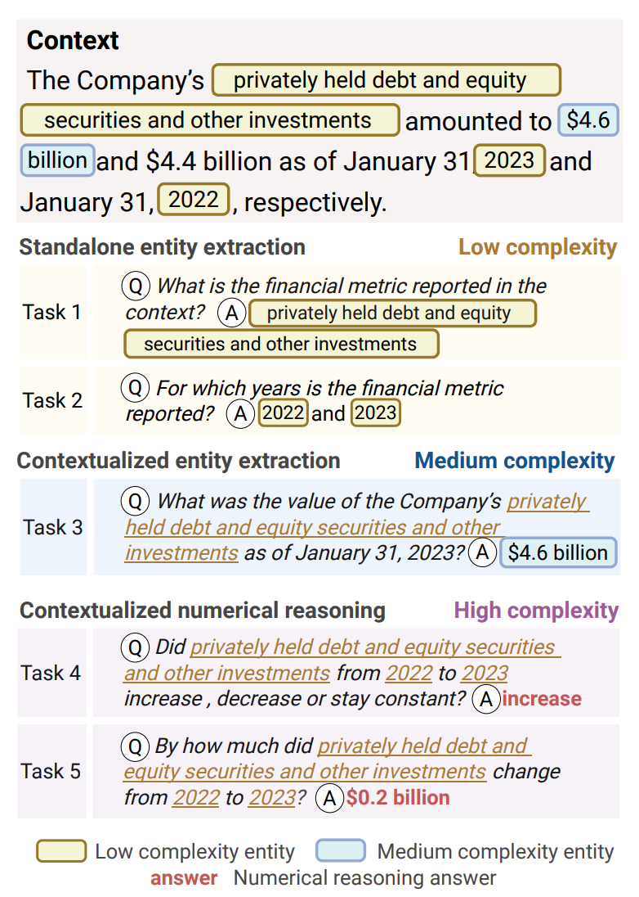

# PROFIT: Numerical Reasoning in Legal Documents Using SEC Filings

We introduce PROFIT (Processing and Reasoning Over Financial Information in Text), a question-answering (QA) benchmark to evaluate the numerical understanding abilities of language models in legal texts. PROFIT tests the ability of large language models (LLMs) to understand and reason over numerical entities. We use and extend the [EDGAR 10-K corpus](https://github.com/lefterisloukas/edgar-crawler) , a collection of annual reports from U.S. public companies. We reframe the extraction of numerical amounts as a QA task that requires both contextual understanding and basic numerical reasoning. Our work lays the foundation for future research on evaluating and enhancing numerical understanding and complex reasoning in legal NLP.

Our main contributions are as follows: 
- A corpus of 10-K annual filings submitted to the SEC by the 30 corporations represented in the Dow Jones Industrial Average Index, ranging from the reported years of 1993 to 2024, including question-answer annotations;
- A new benchmark comprising five tasks of increasing complexity, including numeric entity extraction and qualitative and quantitative numerical reasoning in dense legal and financial texts;
- A detailed evaluation of LLMs' abilities to perform these numerical reasoning tasks on our dataset.  

## Dataset

Each annual 10-K filing document is composed of indexed legal items, comparable to sections. Raw filing documents are divided into items (*long context*), which are then further divided into sentences (*short context*). The PROFIT benchmark includes items and sentences with numeric currency and percentage values.

## Tasks

Our benchmark comprises five tasks. An example instance is shown in the figure below, where the extracted sentence, which we refer to as *short context*, describes the value of a financial metric across two subsequent years, specifically *debt and equity securities and other investments* in 2022 and 2023. Based on the extracted sentence, two entity extraction tasks, task 1 and 2, are constructed, targeted at the financial metric and the contained years (fixed queries). Task 3 probes the financial metric value from the earlier year. The remaining two tasks, 4 and 5, focus on numerical reasoning, probing the quantitative change, whether the metric increased, decreased, or stayed constant, and on the absolute qualitative change. Our benchmark dataset includes the five task queries (Q1–Q5) along with their corresponding human-reviewed answers (A1–A5). All answers were manually verified by the authors of this paper.



To illustrate the short context setting, we construct an example where the task is to identify a reported financial metric along with the years in which it was reported. From these ground-truth answers (A1 and A2), we derive more realistic tasks that mirror the kinds of questions practitioners ask when analyzing annual 10-K filings. In practice, experts review 10-K filings item by item, which is why our benchmark also provides the full legal items as *long context*.

The legal text itself specifies both the financial metrics and the reporting dates. However, financial analysts are often interested not just in single reported values, but in how those values evolve over time. To reflect this, tasks 4 and 5 in PROFIT introduce numerical reasoning tasks: first requiring a qualitative assessment of the change between two reporting periods, and then a quantitative calculation of that change.

## Steps to generate the dataset from scratch

Are listed in [`generate_dataset/README.md`](generate_dataset/README.md).

### How to run

### Install Python packages

Use the `requirements.txt` to install necessary Python packages. Any Python3 version should work, we used Python 3.12.1. We recommend installing Python packages into a virtualenv:

```
python3 -m venv venv
source venv/bin/activate
pip install -r requirements.txt
```

### Prerequisites

Check the config file [`config.json`](generate_dataset/config.json). For scripts that include Google or OpenAI API access, an **API key** must be specified. The Python scripts expect a json file named either `openai_api_key.json` or `google_api_key.json` in the directory `numerical_reasoning/generate_dataset` (and depending on the first keyword in the name i.e., `openai` or `google` uses separate API wrappers). This file must be valid json with the key `API_KEY`, for example

```
{
    "API_KEY": "MYAPIKEYABCDEFGHJKLMNOPQRSTUVXYZ"
}
```

